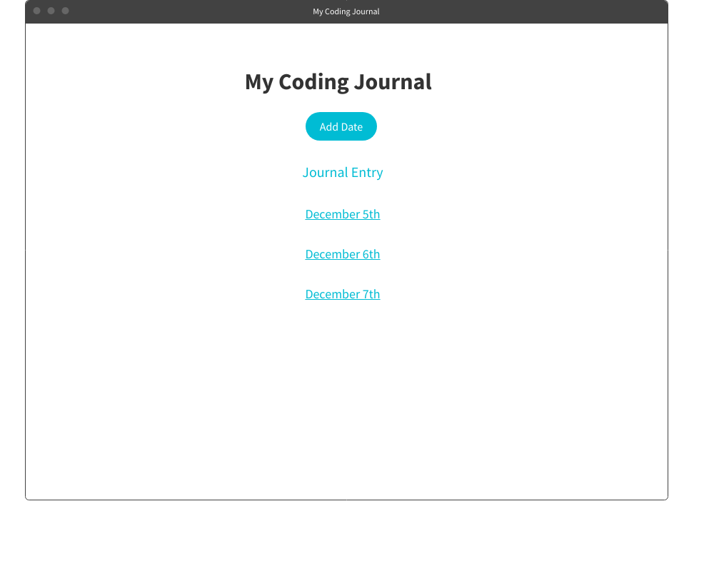
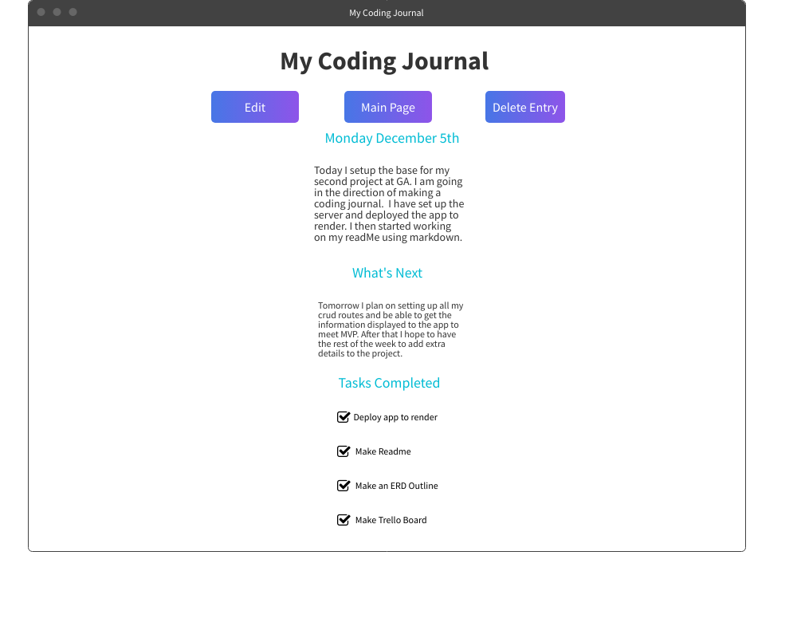
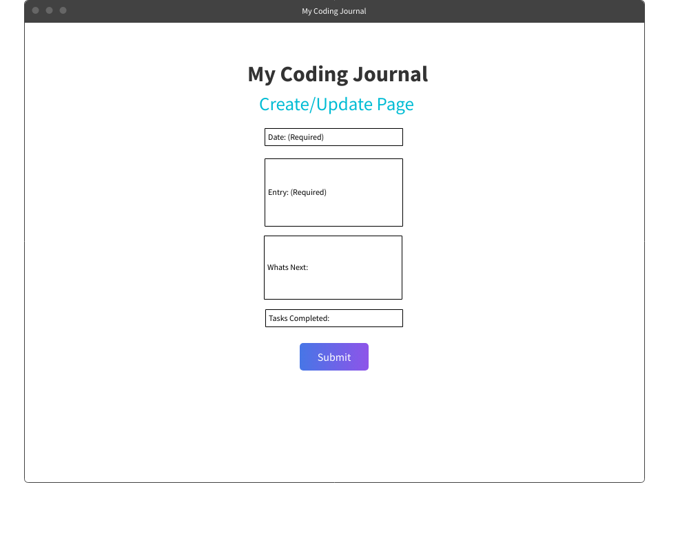
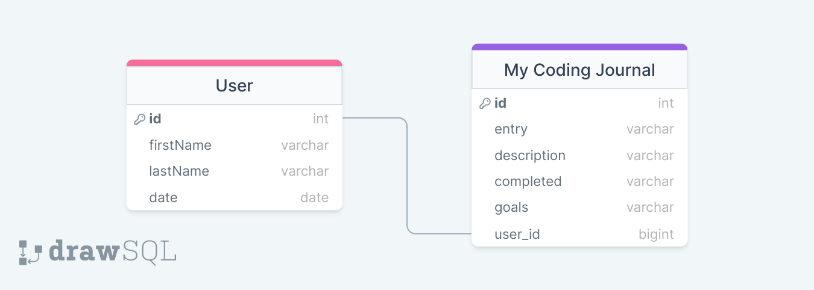

#My Coding Journal
A personal application for you to track and log your coding journey while in the GA Bootcamp. In this application you will be able to keep track of what you have learned each day while setting goals for the future. This will allow users to keep track and log their progress while they become a fullstack developer. 

## Technologies Used
- Node
- Express
- MongoDB
- CSS
- Markdown
- Trello
- Mockflow
- DrawSQL

## Functions 
- Users will be able to use the application on desktop and mobile
- Users can see all their entries
- Users can create a new entry
- Users can edit an entry
- Users can delete an entry 

## Link to Planning Trello Board
[Trello Board](https://trello.com/invite/b/Z24GoIwV/ATTIb1eb4c073d2dc78fe45bd9b465809044B449BE3E/project-2)

## Wire Frames

## ERD
